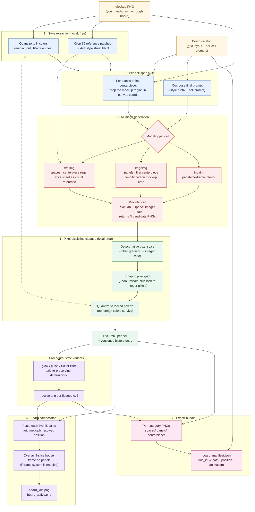

# Board Factory

A pipeline for generating pixel-art board game assets from a single mockup. Purpose-built for game-board layouts that combine three asset categories — small repeating perimeter spaces, large illustrated feature panels, and a single complex centerpiece. Outputs a coherent, palette-locked, game-ready asset set in pixel art.

## Why this exists

Most AI asset pipelines assume "UI screen → many small isolated assets." Board Factory assumes "fixed board layout → tiles that must visually integrate, in pixel art, with state changes." The differences matter:

- **Style discipline matters more than coverage.** All assets share one quantized palette extracted from a reference image, so they look like they came from one artist.
- **Three asset categories, three generation strategies.** Board spaces are batch-generated for coverage. Feature panels are per-asset with rich prompts. The centerpiece uses image-to-image translation from your existing mockup on the first pass, then text-to-image regeneration against the locked style sheet.
- **Pixel cleanup is a first-class step.** AI generators produce smooth gradients pretending to be pixel art; Board Factory snaps everything to a shared palette and pixel grid so the output is real pixel art, not "AI's idea of pixel art."
- **Geometry is declarative, not detected.** Your board layout is a known grid; you describe it once in the board catalog (stored in the application database and edited in the web UI) and the pipeline computes positions arithmetically. No vision-AI bbox detection that fails on dense small tiles.

## AI Agent Pipeline

This is what the pipeline **does to an image**, end to end. One mockup PNG goes in; a folder of palette-locked, grid-snapped pixel-art tiles plus a board manifest comes out. Every step below runs without you in the loop except the explicit review pass between Cleanup and States.




What each band does to the pixels:


| Band                          | Image transformation                                                                                                                                                                                                                                         | Why it's there                                                                                                                                                                                                                                                 |
| ----------------------------- | ------------------------------------------------------------------------------------------------------------------------------------------------------------------------------------------------------------------------------------------------------------ | -------------------------------------------------------------------------------------------------------------------------------------------------------------------------------------------------------------------------------------------------------------- |
| **Style extraction**          | One mockup PNG → a fixed N-color palette (median-cut quantization) + a 4×4 style sheet stitched from mockup crops.                                                                                                                                           | Every later AI call sees the same style sheet; every later cleanup quantizes against the same palette. The whole board ends up looking like one artist made it.                                                                                                |
| **Per-cell spec build**       | Catalog `+ mockup` → one `DrawSpec` per cell containing the final prompt, the target pixel size, and (for img2img modes) a cropped mockup region.                                                                                                            | The catalog says "panel `brazier_demon` lives at bbox X with target size 256×256"; the spec build resolves that into "crop *this rectangle* of the mockup, scale to 256×256, send with *this* prompt."                                                         |
| **AI image generation**       | One spec → N candidate PNGs. Modality is data on the spec, not a code branch: spaces and centerpiece-regen go txt2img; panels and the first centerpiece go img2img from the mockup crop; panels-into-frames go inpaint into the interior mask.               | Each modality is what gives that asset class its best shot at landing on the first try — perimeter spaces need consistency conditioned on the style sheet, panels need to honor the mockup composition, the first centerpiece needs to anchor the whole board. |
| **Pixel-discipline cleanup**  | Each raw candidate PNG is run through three filters in series: detect the native pixel scale (the integer ratio the model "thinks" it's drawing at), snap to that grid (undo gradient bleed introduced by upscale), and quantize back to the locked palette. | This is the difference between *real* pixel art and "an AI's smooth painting that happens to be small." No raw provider output is ever shown; `history/` only ever contains cleaned PNGs.                                                                      |
| **Live + history**            | The first cleaned candidate is promoted to `live/<cat>/<id>.png`. Every candidate (including the rejected ones) is archived under `history/<cat>/<id>/<ts>__<seq>.png`.                                                                                      | Live is what the board shows. History lets you scroll back and restore any earlier version with one click — failed gens are just inputs to the next iteration, not lost work.                                                                                  |
| **Procedural state variants** | For any cell flagged `needs_active`, the live PNG is run through a deterministic glow / pulse / flicker filter to produce `<id>_active.png`.                                                                                                                 | AI generators drift on every call; an "active" version comes back with subtle composition changes that break alignment. Procedural transforms guarantee pixel-perfect alignment between idle and active.                                                       |
| **Board composition**         | All live tiles are pasted onto a board-sized canvas at their catalog-resolved positions. If the frame system is on, panels also get a 9-slice ornate border composited over them. Two outputs: `board_idle.png` and `board_active.png`.                      | A coherence check before export — you see the assembled board exactly the way the engine will render it.                                                                                                                                                       |
| **Export bundle**             | Live PNGs are copied into `export/{spaces,panels,centerpiece}/` and a `board_manifest.json` is written mapping each tile id to its file path, board position, and any animation metadata.                                                                    | What an indie game engine actually consumes. Plop the export folder into your project and the catalog tells the engine where every tile goes.                                                                                                                  |


The whole pipeline is **idempotent at the cell level**: every step is a pure function of `(catalog row, mockup, live tiles for the cells it depends on)`. Re-running any step doesn't re-do work for cells that already have a live asset; "Generate missing" only hits the cells that are still empty, and the per-cell "Regenerate" button only redoes that one cell.

The only steps that cost money are the AI calls in band 3. Style extraction, cleanup, state variants, composition, and export are all local PIL — free, fast, and run as many times as you want.

## How it works

The pipeline is eight steps. You start jobs from the web app; the only steps that require you to be present are the review steps.

### 1. Style Lock


|                |                                                                                                              |
| -------------- | ------------------------------------------------------------------------------------------------------------ |
| **Input**      | Your mockup PNG + a written style brief (board catalog in the DB, edited in the UI)                          |
| **Powered by** | PIL palette extraction (median-cut quantization to 16–32 colors)                                             |
| **Output**     | `workspace/style/palette.json` (the shared palette) and `workspace/style/style_sheet.png` (visual reference) |


### 2. Catalog Validation


|                |                                                                                                                          |
| -------------- | ------------------------------------------------------------------------------------------------------------------------ |
| **Input**      | Board catalog (validated Pydantic `Catalog` shape, loaded from the database)                                             |
| **Powered by** | Pydantic schema validation                                                                                               |
| **Output**     | A normalized catalog with all board space positions resolved and all panel bboxes verified against the mockup dimensions |


### 3. Generate (branched by category)


| Category           | Strategy                                                           | Candidates    |
| ------------------ | ------------------------------------------------------------------ | ------------- |
| **Board spaces**   | Batch generation per unique design, conditioned on the style sheet | 3 per design  |
| **Feature panels** | Per-panel img2img from the cropped mockup region                   | 3 per panel   |
| **Centerpiece**    | Img2img from the cropped centerpiece region with high strength     | 3 candidates |


### 4. Pixel Cleanup


|                |                                                                                                                          |
| -------------- | ------------------------------------------------------------------------------------------------------------------------ |
| **Input**      | All raw candidates from step 3                                                                                           |
| **Powered by** | PIL — palette quantization + grid snapping                                                                               |
| **Output**     | Quantized candidates (palette-locked, grid-snapped) fed into the live/history asset flow under each board’s `workspace/` |


### 5. Review

Three view modes at `http://localhost:8473`:


| Mode            | Asset type     | Interaction                                                               |
| --------------- | -------------- | ------------------------------------------------------------------------- |
| **Grid**        | Board spaces   | All ~12 unique designs visible simultaneously, click candidate to approve |
| **Carousel**    | Feature panels | One panel at a time, all candidates side-by-side                          |
| **Single-cell** | Centerpiece    | Large preview with regenerate / clean / restore-from-history controls     |


### 6. State Generation


|                |                                                                                                              |
| -------------- | ------------------------------------------------------------------------------------------------------------ |
| **Input**      | Live feature panels with `needs_active: true`                                                                |
| **Powered by** | Procedural shader-style transforms (glow, pulse, flicker) — deterministic, palette-preserving                |
| **Output**     | `workspace/live/<category>/<id>_active.png` for every panel (and the centerpiece) that needs an active state |


### 7. Board Compositor


|                |                                                                                                                              |
| -------------- | ---------------------------------------------------------------------------------------------------------------------------- |
| **Input**      | All approved assets + board geometry                                                                                         |
| **Powered by** | PIL `Image.paste()`                                                                                                          |
| **Output**     | `workspace/preview/board_idle.png` and `workspace/preview/board_active.png` — the assembled board for visual coherence check |


### 8. Export


|            |                                                                                                             |
| ---------- | ----------------------------------------------------------------------------------------------------------- |
| **Input**  | All approved assets + animation configs                                                                     |
| **Output** | `export/` (under each board id) — individual PNGs by category, plus `board_manifest.json` for engine import |


## Requirements

- Docker + Docker Compose
- A [PixelLab API key](https://www.pixellab.ai) or OpenAI Images API access (see `docker-compose.yml` — default provider is configurable)
- Optionally: a local Stable Diffusion install for the offline path (Apple Silicon recommended)

You can also run end-to-end with the **mock provider** to test the pipeline structure without spending anything — useful for validating your catalog and seeing the web app before plugging in a real model.

## Setup

1. Fill in API keys in `docker-compose.yml` under the `**board-factory`** service (or use a `.env` file in the same directory; Compose interpolates variables). For PixelLab, set `PIXELLAB_API_KEY`. For OpenAI image generation, set `OPENAI_API_KEY`. Use `BOARDFACTORY_PROVIDER: mock` to exercise the app without external APIs.
2. (Optional but recommended) Stop git from tracking your edits to that file:
  ```bash
   make protect-keys
  ```
3. Create or pick a board under `data/boards/<board-id>/`, put your mockup at `data/boards/<board-id>/mockup/board.png`, and edit geometry and prompts in the **web UI**. Catalog data lives in the application database. Optional legacy `catalog.yml` on disk is still imported when present and the DB row is missing.
4. Bring everything up:
  ```bash
   make up
  ```
   On first boot, the app runs **Alembic migrations** during startup (`storage.bootstrap`). You can also run `make db-upgrade` manually inside the stack.

## Database: PostgreSQL (default) vs SQLite

**Docker Compose (default)** uses the `**postgres`** service and sets `BOARDFACTORY_DATABASE_URL` on `**board-factory`** to a `postgresql+psycopg://…` URL. Application data (users, sessions, catalog rows, jobs, ownership, …) lives in Postgres inside the `**postgres_data`** volume — not in git.

**SQLite at the repository root** (`.boardfactory.db`) is still supported: omit or override `BOARDFACTORY_DATABASE_URL` and set `BOARDFACTORY_DB_PATH` if you want a file-backed DB (useful for portable checkouts or simple local runs). The repo may carry a committed `.boardfactory.db` for shared dev fixtures; **WAL sidecars** (`.boardfactory.db-wal`, `.boardfactory.db-shm`) should not be committed — see below.

`make db-checkpoint` merges SQLite WAL into `.boardfactory.db` and is only relevant when you use **SQLite**, not when using Postgres-only dev.

## Fresh clone

1. `git clone` and `cd` into the repo.
2. Set provider/API keys in `.env` or `docker-compose.yml` if you use real generation.
3. `make up` — wait for Postgres to become healthy; migrations run when the app starts.
4. Open `http://localhost:8473`. If the database was empty after migrations, revision `**0007_seed_dev_admin_user`** seeds a dev admin; `**board_ownership.backfill_owned_boards_if_empty()`** can attach on-disk boards when the `owned_boards` table is empty. For a long-lived **Postgres** volume, your existing users and data persist across restarts.
5. Add API keys under **Account → Connections** if you did not set compose-level keys.

For **SQLite** workflows with a committed `.boardfactory.db`: merge WAL before committing the main file (`make db-checkpoint`). Tracked PNGs under `data/boards/*/workspace/live/` and style snapshots may be part of git; large generated trees (`history/`, raw churn) stay ignored and rebuild when you run the pipeline again.

### SQLite WAL files (`.db-wal` / `.db-shm`)

Relevant only when the app uses **SQLite** with WAL enabled: recent changes may appear in sidecar files until checkpointed. `**make db-checkpoint`** folds WAL into `.boardfactory.db` and removes those sidecars so they do not clutter `git status`.


| File               | Role                                          |
| ------------------ | --------------------------------------------- |
| `.boardfactory.db` | Main SQLite database file (when using SQLite) |


## Usage

Typical workflow:

1. `make up` and open `http://localhost:8473`.
2. Pick or create a board, upload a mockup if needed, edit the catalog in the UI.
3. Run pipeline steps from the app (style lock, generate, review, export, …). Progress appears in the job tray.

For debugging, `make shell` opens a shell in the `**board-factory`** container (`/repo` is the bind-mounted repo, `/app` is the app package). The pipeline is imported as the `**boardfactory`** Python package from `/repo/pipeline`.

## Folder overview

```text
pipeline/                 Python pipeline library (boardfactory), used by the web app
  boardfactory/
    providers/            Pluggable image-gen providers (PixelLab, OpenAI, mock)
    schemas/catalog.py    Pydantic Catalog model (the per-board spec)
    ops/                  Per-cell + per-category orchestration (draw_cell, orchestrate)
    steps/                Board-level steps (style_lock, states, compositor, export)
    assets.py             On-disk live + history per cell (with DB event hooks)
app/                      FastAPI app
  routes/                 HTTP entry points (auth, board, assets, jobs)
  services/               Use-case services (boards, catalog, asset_index, …)
  storage/
    board_store.py        BoardStore protocol + LocalBoardStore singleton
    fs/                   Path helpers that delegate to the configured store
    db.py                 SQLAlchemy engine + session_scope
    models/               ORM table definitions
  pipeline_adapters.py    Worker callables that bridge routes ↔ pipeline ops
  jobs.py                 In-process JobRunner + SSE pub/sub
data/                     Per-board mutable application data (BoardStore root)
  boards/
    <board-id>/
      mockup/             Source mockup PNG (e.g. board.png)
      workspace/          Pipeline artifacts (style, live, history, preview, …)
      export/             Engine-ready export (tiles + board_manifest.json)
.boardfactory.db          Optional SQLite DB at repo root (only when not using Postgres URL)
docs/
  architecture.md         Design notes (start here for backend internals)
  diagrams/               Pipeline + data-model diagrams
  spec_prose.md           Per-board catalog example walkthrough (damnation board)
  deployment-single-vm-cheap-plan.md   Operations: low-cost single-VM deployment
```

For the backend internals, see [docs/architecture.md](docs/architecture.md) and the two diagrams under [docs/diagrams/](docs/diagrams/):

- [diagrams/pipeline.md](docs/diagrams/pipeline.md) — backend pipeline (browser → route → JobRunner → adapters → pipeline ops → provider, with the asset-index DB hook)
- [diagrams/data-model.md](docs/diagrams/data-model.md) — relational tables (users, ownership, catalog, asset history index, jobs, costs)

## Make targets


| Target                | What it does                                                           |
| --------------------- | ---------------------------------------------------------------------- |
| `make up`             | Build images and start **postgres** + **board-factory**                |
| `make down`           | Stop all services                                                      |
| `make logs`           | Tail **board-factory** logs                                            |
| `make shell`          | Bash shell inside the **board-factory** container                      |
| `make rebuild`        | Rebuild the **board-factory** image and recreate the container         |
| `make clean`          | Remove generated files under per-board `workspace/` style/preview/logs |
| `make protect-keys`   | `git update-index --skip-worktree` on `docker-compose.yml`             |
| `make unprotect-keys` | Undo protect-keys                                                      |
| `make test`           | Run pytest inside **board-factory** (container must be up)             |
| `make db-upgrade`     | `alembic upgrade head` (same DB URL as the app)                        |
| `make db-current`     | Show current Alembic revision                                          |
| `make db-checkpoint`  | SQLite only — merge WAL into `.boardfactory.db` for a clean commit     |


## Configuration

Most settings live in `**docker-compose.yml`** under the `**board-factory`** service `environment` block (or in a `.env` file next to it). Common variables:

- `BOARDFACTORY_PROVIDER` — e.g. `openai`, `pixellab`, or `mock` (see `pipeline/boardfactory/providers/`).
- `BOARDFACTORY_PALETTE_SIZE` — colors in the locked palette (default `24`).
- `BOARDFACTORY_SPACE_CANDIDATES`, `BOARDFACTORY_PANEL_CANDIDATES`, `BOARDFACTORY_CENTERPIECE_CANDIDATES` — candidate counts per step.
- `BOARDFACTORY_DATABASE_URL` — explicit SQLAlchemy URL (Compose sets Postgres by default).
- `BOARDFACTORY_REPO` — repository root inside the container (`/repo`).

After changing Compose env, run `make down && make up` (or `make rebuild` if you changed the image).

## Developing

Compose bind-mounts parts of `./app/` into `/app`. If you add a **new top-level module or package** under `app/` that is not yet listed in `docker-compose.yml` volumes, either add a volume line for it or rebuild the image so the file exists in the container.

## Costs

With a paid API provider on a typical board (~12 unique board space designs + 8 panels + 1 centerpiece), ballpark costs depend on provider pricing. State generation, compositing, cleanup, and export are local compute.

## Troubleshooting

`**PIXELLAB_API_KEY is not set`**

Add it under `**board-factory`** in `docker-compose.yml` or Account → Connections, then restart. Or set `BOARDFACTORY_PROVIDER: mock`.

`**segment` produces poor cutouts on detailed assets**

Tighten the asset bbox in the board editor (catalog data in the database).

**Generated assets don't match the original mockup style**

Tighten `style.prompt` in the board UI and re-run **Style** / **Generate** from the app.

**I accidentally committed my API keys**

Run `git rm --cached docker-compose.yml`, rotate the key at the provider, paste the new key, then `make protect-keys`.