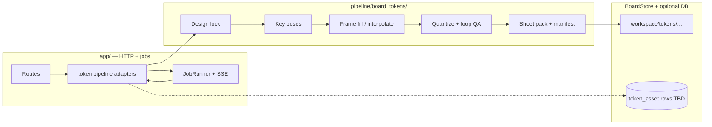

# Board token pipeline — proposal

**Status:** Proposal (not implemented)  
**Audience:** Product + engineering alignment before adding `pipeline/…` code or DB tables  
**Related:** [Backend pipeline — request to art](diagrams/pipeline.md), [Card Factory spec](card-factory-spec.md) (isolated pipeline + gated steps), [Board token character guidance](board-token-character-guidance.md) (camera, frames, AI, idle), [Project export spec](project-export-spec.md) (bundle shape). **Frontend:** reuse board templates, side panel, and job UX — see **§8**.

---

## 1. Goal

A **third isolated image pipeline** (alongside `pipeline/boardfactory/` and the planned `pipeline/cardfactory/`) that:

1. **Design-locks** a token (silhouette, locomotion profile, palette tie-in to a board).
2. **Generates** raster frames (key poses → full loops) using the same **provider discipline** as Board Factory (style prefix, palette quantize, cleanup).
3. **Assembles** engine-ready **sprite sheets + manifest** (pivots, fps, clip names, `edge_kind` hints for walk variants).
4. **Publishes** artifacts under the **board workspace** (or linked asset store) so **export** and **runtime** can consume them without importing Board Factory cell generation.

This document proposes **shape and boundaries**; it does not lock schema IDs.

### 1.1 Static token art vs animation — where `history` / `live` belong

Your mental model matches how we should spec this:

**Static assets (design reference, key poses, “the character look”)**

- You **generate or pick** a canonical reference (and optional key stills). There is **no need** for the same **cell-style** `history/` + `live/` pattern here — that pattern exists because every cell regen stacks **many single-image candidates** over time.
- For statics, the workflow can stay **simple**: **keep** (becomes / updates the design lock) or **discard** (scratch in `candidates/` or temp, never promoted). Replacing the canonical is a **deliberate overwrite**, not an endless gallery unless you *want* a small “reference variants” folder for UX.

**Animations (assembled loops: clips, atlas, manifest)**

- Animations are **expensive and subjective** — you want to **compare** “new pack vs current,” **roll back**, and **promote** when satisfied.
- **Here** is where **`live`** and **`history`** pay off: each **history** entry is a **full animation package** — the same logical thing as **“all loops the engine loads together”** (e.g. `atlas.png` + `manifest.json`, or one folder per **publish run**). **`live`** points at the **single current promoted package**; **`history`** retains **older packages** so you can side‑by‑side or revert.

So for the **board token feature**: **`live` / `history` version the animation bundle**, not each frame inside a walk loop, and **not** the static reference PNG unless you explicitly want a second gallery for references (optional product choice).

**Summary**

| Artifact | Versioning | Rationale |
|----------|------------|-----------|
| Static reference / design lock | **Keep or replace** (lightweight) | Low churn; binary decision is enough. |
| **Published animation** (all clips + manifest) | **`live` + `history`** | High churn; compare runs; rollback. |

---


## 2. Design principles (borrowed from existing pipelines)

| Pattern | Board Factory today | Card Factory spec | **Proposed token pipeline** |
|--------|----------------------|---------------------|----------------------------|
| **Package isolation** | `pipeline/boardfactory/` | `pipeline/cardfactory/` **must not** import `boardfactory` | New tree **`pipeline/board_tokens/`** (name TBD) — **no** `from boardfactory import …` inside it. |
| **Atomic unit** | `draw_cell(DrawSpec)` — one provider-bound operation with cleanup + history | Per-card masked gen steps | **`generate_token_frame(spec)`** or **`render_clip(spec)`** — one logical provider call or deterministic assemble step; same **ProgressSink** granularity idea. |
| **Orchestration** | `ops/orchestrate.py` loops specs | Ordered table in Card Factory §8 | **`ops/orchestrate_token.py`** — loops **clips** (idle, walk_h, walk_up, …) and **poses** within a clip. |
| **Gating** | Frame atelier: propose → refine → commit | Frame **commit** before full cards | **Design lock** (canonical reference PNG + JSON) **before** bulk frame gen; optional **user pick** among N reference candidates (mirrors Atelier / Card frame gate **lightly**). |
| **Disk contract** | `workspace/history|live|…` per cell | Card workspace TBD | **Statics:** `references/` + optional `candidates/` — pick / lock, no cell-style history required. **Animations:** `animations/live/` (current bundle) + `animations/history/<run_id>/` (prior full packs for compare / rollback). Working frames under `clips/…/`. |
| **App boundary** | `pipeline_adapters.py` + `enqueue_pipeline_job` | Same for cards | New **`token_*`** adapter entry points; **routes** under `domains.boards` or future `domains.tokens` — pipeline stays HTTP-ignorant. **Templates/JS** reuse board shell, side panel, jobs — **§8**. |
| **Style / palette** | Reads `workspace/style/` + catalog | Linked board palette passed as data | **Input:** resolved palette + short **style sentence** from catalog / `board_token_character_guidance` contract; pipeline never reads DB directly if you want strict isolation (app passes dict). |

---

## 3. High-level flow



---

## 4. Proposed workspace layout (per board, per token)

Under `data/boards/<user>/<board_id>/` (same root Board Factory uses):

```
workspace/tokens/<token_slug_or_uuid>/
  design_lock.json          # locomotion, facing policy, canvas WxH, pivot policy
  references/
    canonical.png           # locked static “truth” — replace explicitly; no history/live required
  candidates/               # optional: scratch refs before you commit to canonical
  clips/                    # working area while building the next animation pack
    idle_breath/
    walk_horizontal/
    ...
  animations/
    live/                   # CURRENT promoted pack: atlas + manifest (+ loose PNGs if any)
    history/
      <run_id_or_ts>/       # prior FULL packs — same shape as live/; for A/B and rollback
```

**`animations/live/`** = one coherent **version** of **all loops** the game loads (full animation set). **`animations/history/…`** = older **complete packs** after you regenerate or tweak timing / atlas. **`clips/`** holds **in-progress** frames until you pack and **publish** into `live/` (and push the previous `live/` into `history/`).

Export and runtime read **`animations/live/`** by default.

---

## 5. Pipeline steps (ordered, Card Factory–style table)

Steps assume **pixel raster output** and **design_lock** present. Provider calls mirror **Board Factory**: txt2img / img2img with **strong reference lock** for keys; inpaint rarely unless extending limbs.

| Step | Name | Purpose | Notes |
| --- | --- | --- | --- |
| **0** | **Resolve context** | Load **palette**, **board token spec** (from catalog JSON or sidecar file), **smallest perimeter cell** rect for scale hint (geometry from `domains.spaces.geometry` / export layout — **computed in app**, passed as numbers). | No pipeline import from `domains.*`; plain dict in. |
| **1** | **Design lock** | Persist `design_lock.json`; ensure **canonical** reference exists (upload or select from candidates). | Gate: no step 2+ without lock **unless** exploratory “candidates only” job. |
| **2** | **Key poses** | Generate **contact / passing** (walk) or **extrema** (float) **still images** per clip plan from [board-token-character-guidance](board-token-character-guidance.md). | One provider batch per pose set; write to `clips/<name>/keys/`. |
| **3** | **Inter-frame generation** | Either **manual** (artist uploads sheets) or **AI fill** between keys (img2img chain with high structure lock) or **duplicate+offset** for cheap float loops. | Highest variance step — isolate behind **sub-progress** in sink. |
| **4** | **Register + pivot** | Crop to **fixed canvas**, set **stable pivot** per frame (ankle/shadow rule from guidance doc). | Deterministic PIL; unit-testable without GPU. |
| **5** | **Palette + cleanup** | Reuse Board Factory–style **quantize_to_palette**, **de-speckle** / single-pixel flicker removal. | Could duplicate small helpers inside `board_tokens` to avoid import (Card Factory precedent). |
| **6** | **Loop QA** | Automated check: first/last frame delta under threshold; optional **foot-slide** heuristic (COM drift vs claimed contact). | Fail → log + mark job `warning` or retry pose 2 only. |
| **7** | **Pack atlas** | Bin-pack frames; emit `manifest.json` (**clip id**, **frame rects**, **fps**, **loop**, **facing** / **edge_kind** routing table). | MVP: one atlas per token; later multiple resolutions. |
| **8** | **Publish** | Move working pack into **`animations/live/`**; move previous **`live/`** tree into **`animations/history/<run_id>/`**; optional **DB row** per publish (token_id, run_id, sha256 of manifest/atlas). | Mirrors “promote + archive prior” without cell-per-PNG history. Same **history_push** listener pattern **if** you want SQL parity. |

**Optional step 2b — Video pull:** generate short clip, extract frames — treat as **untrusted input**; always run steps 4–6.

---

## 6. Atomic operations (Board Factory `draw_cell` analogy)

| Operation | Responsibility | Comparable to |
|-----------|----------------|----------------|
| `build_token_frame_spec(...)` | Pure: prompt, ref image path, mode, size | `spec_for_space` / `DrawSpec` builders |
| `generate_token_still(spec, provider, sink)` | Provider → raw PNG | Single leg of `draw_cell` without full history semantics |
| `append_token_history(...)` | Write candidate + meta under `clips/…/history/` | `assets.push_to_history` simplified |
| `promote_token_frame(...)` | Choose winner into clip folder | `promote` |
| `assemble_atlas(...)` | Deterministic pack | `steps/export.py` local logic |

Whether **every** candidate is kept in SQL like `asset_versions` is a **product** choice; MVP can be **disk-only + one live manifest**.

---

## 7. Orchestration jobs (user-visible units)

Suggested **job operations** (strings for `Job.operation` / SSE), analogous to `frame.propose` / `generate_missing_spaces`:

| Operation | Scope | Progress semantics |
|-----------|--------|--------------------|
| `token.design_explore` | N reference candidates, no lock | `total=N` |
| `token.design_commit` | Writes lock + canonical | single step |
| `token.generate_clip` | One clip name (e.g. `walk_horizontal`) | `total = key_poses + fill passes` |
| `token.generate_all_clips` | All clips in manifest template | outer bar = clip count |
| `token.pack_publish` | Atlas + manifest only | fast, no provider |

Cancel: cooperative `threading.Event` between sub-calls, same as existing adapters.

---

## 8. Frontend — shared layouts and workflows with boards

**Product goal:** Board Factory should feel like **one suite of tools** — same core **UI design and interaction patterns** whether someone is editing a **board**, generating **tokens**, or (later) other satellite flows. Switching from **board generator** to **token generator** should **not** require learning a new app.

**Concrete direction**

- **Reuse the board shell** where tokens are board-scoped: same **nested URL** pattern (`/users/…/board-games/…/…`), same **page chrome** (nav, typography, spacing from existing templates), and the same **“work happens on a canvas / plate with a docked inspector”** rhythm as `board.html` + **side panel** (`side-panel.js`).
- **Reuse job UX end-to-end:** **`jobs.js`** + **SSE** job tray, progress bars, cancel, cost hints, and log tail — token jobs are just additional **`Job.operation`** values (`token.*`), not a second notification system.
- **Map concepts, not screens 1:1:** board **cell** → token **clip** or **animation pack**; board **live/history per PNG** → token **animation `live/` vs `history/<run>/`** (§1.1); **“Generate”** / **“Regenerate”** affordances sit in the **same** action areas (tiles, primary buttons) users already know.
- **Shared components over time:** extract **shared partials** (e.g. `_base.html` regions, modal shells, form controls) and **CSS tokens** from `style.css` so Card Factory and token flows inherit the same **density, button hierarchy, and muted/primary** language — even if the first token ship duplicates a little markup, **behavior** should match boards on day one.

**Out of scope for the pipeline package** (stays in `app/`): all of the above is **FastAPI routes + templates + static JS**; `pipeline/board_tokens/` remains unaware of HTML.

---

## 9. Integration points

1. **Catalog / DB** — Add a **`tokens[]`** (or `game_pieces[]`) block on `board_games.body_json` **or** a sidecar file path; pipeline reads **only** what app passes in the job payload to stay isolated.
2. **Export** — Extend **export stages** (see `project-export-spec.md` §153) to copy **`workspace/tokens/**/animations/live/*`** into the bundle and reference manifest paths in top-level JSON.
3. **Runtime movement** — Path graph with **`edge_kind`** (from character guidance §3.8) is **engine** or **exporter** responsibility; pipeline outputs **clips**; a small **runtime router table** in manifest maps `edge_kind` → clip id.
4. **Space animations** — If you later ship **`pipeline/space_animations/`** for perimeter tile loops, **tokens remain separate**: tile animation = surface under pawn; token = pawn. Shared concerns: **palette**, **fps**, **atlas** conventions — document in one **“pixel animation manifest”** schema later.

---

## 10. What not to put in this pipeline

- **No** HTTP handlers inside `pipeline/board_tokens/`.
- **No** dependency on **`draw_cell`** for token pixels (different failure modes, different history shape) — optional **shared provider factory** only at **`app/`** or neutral **`pipeline/common/`** if you extract one later.
- **No** dice / rules engine — pipeline outputs **art**; game logic lives in app or engine.

---

## 11. MVP vs later

**MVP**

- One token per board; **horizontal walk + idle** only; **flip X**; manual upload of sheet **or** steps 2–5 automated for one clip.
- Disk manifest only; export copies files.

**Later**

- `walk_up` / `walk_down` clips, multi-token, per-player recolor pass (deterministic HSV or palette swap), LOD atlases, link to Card Factory for “deck mascot” continuity.

---

## 12. Open decisions

- [ ] Package name: `board_tokens` vs `game_tokens` vs `pawns`.
- [ ] DB mirroring: full `asset_versions`-style rows vs token-only table vs disk-only MVP.
- [ ] Provider: reuse **only** `get_provider` from app vs vendor minimal OpenAI wrapper inside package (Card Factory §9.2 tradeoff).
- [ ] Whether **token** generation jobs require **`scope_board`** lock alongside cell jobs (probably **yes** if writing same `workspace/` tree).

---

## 13. Summary

Treat **board tokens** like **Card Factory**: **isolated pipeline package**, **gated design lock**, **ordered steps table**, **job adapter + SSE**, **workspace + manifest**. Reuse **Board Factory’s mental model** for **atomic generate → cleanup → history → promote** and **orchestrate loops**, but **do not** fold token logic into `draw_cell` — keep a dedicated **`generate_token_still`** path so cell and token lifecycles stay separable and export stays a thin **stage** over both trees.

When this proposal is accepted, next artifacts are: **JSON Schema for `manifest.json`**, **catalog `tokens[]` shape**, and **`pipeline_adapters.token_*`** stubs wired to **no-op** or mock provider in CI.
