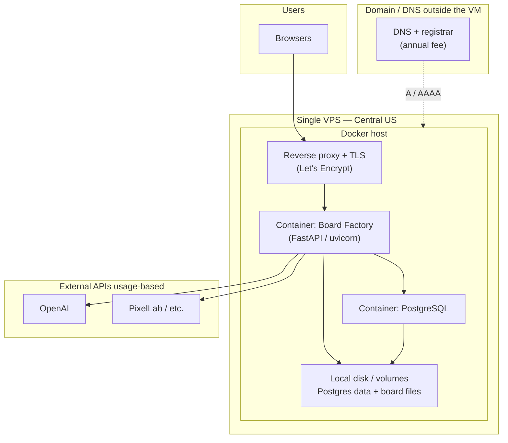

# Low-cost deployment plan (single VM + self-hosted Postgres)

This document describes the **inexpensive single-server** option discussed for Board Factory: one **cloud VPS** in **Central US**, **Docker Compose** with the **web app** and **PostgreSQL** in **separate containers**, and **no managed database** product.

**Scope:** on the order of **~30 users**, **bursty** usage, **infrastructure** cost focus. **OpenAI / PixelLab** and other API usage is **billed separately** and is not part of the numbers below.

---

## Assumptions

| Assumption | Choice |
|------------|--------|
| Region | **Central US** (e.g. AWS `us-east-2`, GCP `us-central1`, or a provider’s **Chicago / Ohio / Iowa**-aligned region) |
| Topology | **One** virtual machine; all app components run on that host |
| App packaging | **Docker Compose**: `board-factory` + `postgres` services |
| Database | **PostgreSQL in a container**, data on a **named volume** (or attached block storage) — **not** RDS/Neon/Render Postgres |
| TLS | **Let’s Encrypt** (e.g. Caddy, Traefik, or certbot in front of the app) on the same VM |
| Domain | **Registrar** + DNS (DNS can be free, e.g. Cloudflare) — **annual** fee, not part of the monthly VPS line item in the table below |

---

## Per-service plan (what each piece is)

| Service / concern | What it is on this plan | Sizing (ballpark) | Est. cost (USD) |
|-------------------|-------------------------|-------------------|-----------------|
| **Compute (VPS)** | Single **Linux** VM: Docker engine runs **two** containers (app + Postgres) | **1–2 vCPU**, **2 GB RAM** (1 GB is possible if bursts are light; 2 GB is a safer default for Pillow + PG) | **~$8–$24 / month** (varies by provider and exact size) |
| **Block / disk** | OS disk + **Postgres data** + **repo / board assets** (`boards/`, `workspace/`, etc.) on the same host | Budget **20–50 GB** initially; grow as assets grow | **~$2–$8 / month** (often bundled GB in the VPS plan; extra volumes priced per GB) |
| **Egress** | Outbound traffic (HTML, PNGs, API responses to browsers) | Usually within **1 TB** included on many VPS plans | **$0** in bundle; **overage ~$0.01/GB** if applicable |
| **PostgreSQL** | **Container** on the **same VM** as the app; **not** a separate cloud database SKU | Small instance; tune later if needed | **$0** extra platform fee (included in the VM) |
| **Web application** | **Container**: FastAPI + uvicorn + pipeline library | Shares CPU/RAM with Postgres on the one VM | **$0** extra (same VM) |
| **Reverse proxy + TLS** | Terminates HTTPS, forwards to app (e.g. **:443 → app :8473**) | Negligible CPU vs. generation workload | **$0** (software on same VM) |
| **Domain** | **Registrar** + optional **DNS** host | One hostname → VM **A/AAAA** records | **~$10–$15 / year** for a common **.com** (recurring renewal, not a one-time lifetime purchase) |
| **Backups (optional)** | Volume snapshots and/or **pg_dump** to **object storage** | Depends on retention | **~$1–$5 / month** if you add cheap object storage for off-site copies |

**Rough recurring infrastructure band (VPS + typical disk, domain listed separately):** **~$11–$34 / month** — or **~$12–$35 / month** if you mentally amortize **~$1/month** from the annual domain cost.

**API usage (OpenAI / PixelLab):** **usage-based**, often the **largest** variable cost in a heavy generation month; track outside this server budget.

---

## Where to buy: plan details and links

Use **one** compute provider below for the VPS (single monthly bill for the server). Plan names and exact prices change—always confirm on the **pricing** page before you provision. **Central US** usually means picking a region such as **Chicago**, **Ohio**, **Iowa**, or **Dallas** depending on the vendor.

### Compute (VPS — Docker host)

| Provider | Plan / product line that fits this doc | Region examples (Central / US) | Pricing | Create account / console |
|----------|----------------------------------------|----------------------------------|---------|----------------------------|
| **DigitalOcean** | **Basic Droplet** — target **2 GB RAM / 1 vCPU** (or **1 GB** if you accept tighter headroom) | Chicago (`ORD`), NYC (`NYC3`) — verify current slugs in the control panel | [Droplet pricing](https://www.digitalocean.com/pricing/droplets) | [Sign up](https://cloud.digitalocean.com/registrations/new) |
| **Amazon Lightsail** | **Linux/Unix** bundle with **2 GB RAM** (bundle sizes change by region) | **Ohio** (`us-east-2`) is a common Central-adjacent choice | [Lightsail pricing](https://aws.amazon.com/lightsail/pricing/) | [Create an AWS account](https://signin.aws.amazon.com/signup?request_type=register) → then open [Lightsail console](https://lightsail.aws.amazon.com/) |
| **Vultr** | **Cloud Compute** (regular), **2 GB** tier | **Chicago** (`ord`) | [Vultr pricing](https://www.vultr.com/pricing/) | [Create account](https://www.vultr.com/register/) |
| **Akamai Connected Cloud** (Linode) | **Shared CPU** Nanode **2 GB** or next size up if needed | **Chicago, IL** (`us-ord`) | [Linode pricing](https://www.linode.com/pricing/) | [Sign up](https://login.linode.com/signup) |
| **Hetzner Cloud** | **CX22** or **CPX11** class (2 GB RAM options) — often **lowest** monthly rate | **Ashburn, VA** (`ash`) — US East; not literally “Central” but frequently used for US deployments | [Hetzner Cloud pricing](https://www.hetzner.com/cloud/) | [Sign up](https://accounts.hetzner.com/signUp) |

### Domain name and DNS

| Role | Notes | Pricing / product | Links |
|------|--------|-------------------|--------|
| **Registrar** | Register **.com** (or your TLD); **renew yearly**. | At-cost / cheap renewals vary | [Cloudflare Registrar](https://www.cloudflare.com/products/registrar/) · [Namecheap domains](https://www.namecheap.com/domains/) |
| **DNS hosting** | Point **A** / **AAAA** at the VPS public IP; optional CDN later. | Free tier common | [Cloudflare dashboard](https://dash.cloudflare.com/sign-up) (add site after signup) |

### TLS (on the VPS — no separate vendor bill)

| Piece | Notes | Docs |
|-------|--------|------|
| **Let’s Encrypt** | Free certificates; usually handled by your reverse proxy. | [Let’s Encrypt — getting started](https://letsencrypt.org/getting-started/) |
| **Caddy** *(example)* | Automatic HTTPS with minimal config. | [Caddy install docs](https://caddyserver.com/docs/install) |

### Optional off-site backups (object storage)

If you copy **Postgres dumps** or **volume snapshots** off the VM, typical low-cost object storage:

| Provider | Use | Pricing | Sign up / console |
|----------|-----|---------|-------------------|
| **Backblaze B2** | S3-compatible bucket | [B2 pricing](https://www.backblaze.com/b2/cloud-storage-pricing.html) | [Create B2 account](https://secure.backblaze.com/user_signup.htm) |
| **Cloudflare R2** | S3-compatible, free egress to Internet under fair use | [R2 pricing](https://developers.cloudflare.com/r2/pricing/) | [Cloudflare dashboard](https://dash.cloudflare.com/sign-up) |

### External APIs (Board Factory usage — not part of VPS bill)

| Service | Purpose | Sign up / billing |
|---------|---------|-------------------|
| **OpenAI** | Image / pipeline keys as configured in the app | [OpenAI API platform](https://platform.openai.com/signup) |
| **PixelLab** | Pixel art provider (if you use that integration) | Use the vendor’s official signup from their product site (keys are set per account in the app). |

---

## Deployment diagram (what runs on which cloud server)

Everything in the **“Single VPS”** group is **one** rented server (one bill line). External APIs are **not** on your VM.

**Reading the diagram:** Only **one** “cloud server” (the **VPS**) runs your stack. **DNS** points the hostname at that server’s IP. **PostgreSQL** does **not** live on a second cloud server in this plan—it runs **alongside** the app **on the same machine**, in its **own container**.
