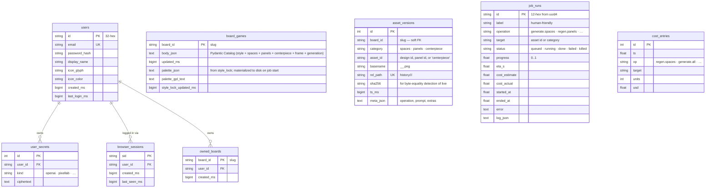

# Data model — relational tables

The Board Factory database holds **users, ownership, the board catalog,
the per-cell history index, persisted job snapshots, and the cost
ledger**. Generated PNGs live on disk under each board's `workspace/`.

The schema is the same on PostgreSQL (default in Compose) and SQLite
(local file mode) — Alembic migrations target both.

## Schema

## Why each table exists

| Table | Purpose | Key design notes |
|---|---|---|
| `users` | Authenticated identities. | The `0007_seed_dev_admin_user` migration inserts a default `admin@admin.com` row when the table is empty so a fresh checkout has a working login. |
| `user_secrets` | Per-user, per-provider secret material (OpenAI / PixelLab keys). | Stored as ciphertext, decrypted at request time when starting a pipeline job. Multiple `kind` values per user are supported. |
| `browser_sessions` | Server-side sessions for the cookie auth middleware. | TTL handled at the application layer via `last_seen_ms`. |
| `owned_boards` | Many-to-one mapping from board slug → owning user. | Boards on disk without an `owned_boards` row are not visible. `backfill_owned_boards_if_empty` attaches every disk board to the oldest user when the table is empty. |
| `board_games` | One row per board. The catalog **is** `body_json` — a single Pydantic-validated JSON blob holding `project`, `board_size`, `style`, `centerpiece`, `board_spaces`, `feature_panels`, `frame`, and `generation`. | This was previously split across one parent row + three child tables (`board_space_layout_rows`, `board_space_designs`, `board_feature_panels`). The 0011 migration collapsed them into `body_json` because the catalog is an aggregate root with strong cross-field invariants — split tables added schema-evolution cost without unlocking any granular query. The palette columns sit alongside because there is a separate writer (`services.workspace_palette`) that materializes them to disk on job start. |
| `asset_versions` | Index of every PNG ever pushed into `workspace/history/`. | Written by `services.asset_index.on_asset_event`, which `app/boot.py` registers on the `boardfactory.assets` listener bus. The unique `(board_id, rel_path)` index makes inserts idempotent so backfills can re-run. The `live` PNG (`live/<cat>/<id>.png`) is detected by byte equality against history files at read time — there is no separate `asset_live` pointer table. |
| `job_runs` | Persisted terminal snapshots of every job. | `JobRunner` keeps active jobs in memory; on completion, `services.job_runs.persist_terminal` writes the row so the tray survives process restarts. Queued or in-flight jobs at restart time are lost — there's no broker. |
| `cost_entries` | One row per provider call that spent money. | `cost_ledger.summary()` aggregates these into the lifetime + session-since-startup costs the UI shows. Pure local-compute steps (style_lock, cleanup, states, compositor, export) do not write rows. |

## What is **not** in the database

Deliberately on disk only:

- Generated PNGs (`workspace/history/`, `workspace/live/`).
- Style assets (`workspace/style/palette.{json,gpl}`, `style_sheet.png`).
  The DB also holds `palette_json` / `palette_gpl_text` — the on-disk
  copy is the canonical thing the pipeline reads; the DB copy lets a
  fresh clone re-materialize them without re-running style_lock.
- Composited previews (`workspace/preview/board_idle.png`, `board_active.png`).
- Engine export (`data/boards/<id>/export/`).

This split keeps the database small and PNGs out of `pg_dump` while
letting the row count (rather than the byte count) drive every query.

## Foreign-key story

| Constraint | Behavior |
|---|---|
| `user_secrets.user_id → users.id` | `ON DELETE CASCADE`. Deleting a user removes their stored API keys. |
| `browser_sessions.user_id → users.id` | `ON DELETE CASCADE`. Session rows die with the user. |
| `owned_boards.user_id → users.id` | `ON DELETE CASCADE`. Removing a user releases their board ownership records (the on-disk board directory is unaffected). |
| `asset_versions.board_id`, `cost_entries`, `job_runs` | **No** database FK to `board_games`. The application layer enforces consistency; this lets us reseed Postgres while keeping `data/boards/` on disk intact, and lets us record cost / job rows for boards that don't yet have a catalog row. |

## Migration history (most recent first)

| Revision | What changed |
|---|---|
| `0011_body_json` | Collapsed the 5-table catalog into a single `body_json` column on `board_games` and dropped `board_space_layout_rows`, `board_space_designs`, `board_feature_panels`, plus the per-field scalar columns. |
| `0010_drop_board_catalogs` | Dropped the legacy `board_catalogs` JSON-mirror table — `board_games` is the only catalog source now. |
| `0009_drop_asset_live` | Dropped the `asset_live` pointer table; the canonical `live/` PNG is detected from disk via `live_path`. |
| `0008_space_kind` | Added `space_kind` to space designs (still part of the catalog body today). |
| `0007_seed_dev_admin_user` | Seeds the default dev admin when `users` is empty. |
| `0006_workspace_palette_asset_live` | Added the palette columns to `board_games` (and the now-removed `asset_live`). |
| `0005_owned_boards` | Introduced `owned_boards`. |
| `0004_board_game_relational` | Added the original normalized child tables (later collapsed by 0011). |
| `0003_phase34_catalog_assets` | Added `board_catalogs` (later dropped) and `asset_versions`. |
| `0002_phase2_core_tables` | Added `users`, `user_secrets`, `browser_sessions`, `job_runs`, `cost_entries`. |
| `0001_baseline` | Initial schema. |
