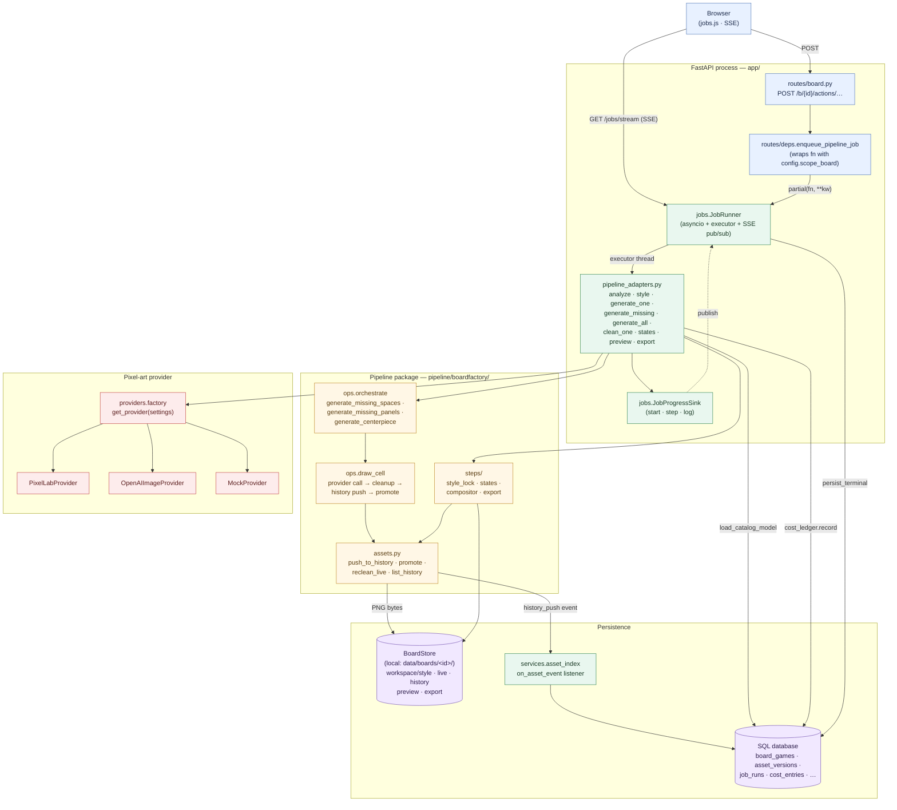

# Backend pipeline — request to art

How a "Generate" click in the browser becomes a PNG on disk, a row in
the database, and a live progress bar in the job tray.

## Layers

## What each layer is responsible for

| Layer | Responsibility | Key files |
|---|---|---|
| **Browser** | Submits `POST /b/<id>/actions/…`, then opens `/jobs/stream` (Server-Sent Events) for live progress. | `app/static/jobs.js`, `app/static/side-panel.js` |
| **Route** | Auth check, request validation, builds the worker callable via `functools.partial`, calls `enqueue_pipeline_job`. Returns either a `303` redirect or `{job_id}` JSON depending on `Accept`. | `app/routes/board.py` |
| **Job Runner** | One per process. Owns the in-memory job registry, dispatches each job to a worker thread (`run_in_executor`), supports cancel via `threading.Event`, and pubs status changes to all SSE subscribers. Persists terminal snapshots to `job_runs`. | `app/jobs.py`, `app/services/job_runs.py` |
| **Adapter** | Plain functions matching the runner's `(job, cancel_event) → cost_usd` shape. Loads the catalog from the DB, validates the mockup, builds the provider, calls into the pipeline, records cost, surfaces logs into `job.log`. | `app/pipeline_adapters.py` |
| **Orchestrate** | "Generate everything missing" loops over `draw_cell` once per cell, advancing the outer progress bar between calls. | `pipeline/boardfactory/ops/orchestrate.py` |
| **Draw cell** | The atomic generate operation: provider call (txt2img / img2img / inpaint per `DrawSpec.mode`) → palette quantize + grid snap → push every cleaned candidate into history → promote the winner as live. Same code path for spaces, panels, and the centerpiece. | `pipeline/boardfactory/ops/draw_cell.py` |
| **Steps** | Step-shaped operations that aren't per-cell: `style_lock` (palette extraction), `states` (procedural active variants), `compositor` (board preview), `export` (engine manifest). | `pipeline/boardfactory/steps/` |
| **Assets** | The on-disk asset model: write a PNG into `history/<cat>/<id>/`, copy to `live/<cat>/<id>.png`, restore from any history entry. Notifies registered DB listeners on every history push. | `pipeline/boardfactory/assets.py` |
| **Provider** | Hosted img2img/txt2img/inpaint behind one Python interface. Selected per board via `catalog.generation.provider`. | `pipeline/boardfactory/providers/` |
| **Asset index** | Listener that mirrors every history push as a row in `asset_versions` (with sha256, ts_ms, sidecar metadata). Wired in `storage.bootstrap.register_pipeline_hooks`. | `app/services/asset_index.py` |

## Per-job lifecycle

1. The browser posts to a route under `/b/<board_id>/actions/…`.
2. The route ensures the requesting user owns the board, builds a `partial`
   binding (e.g. `partial(pipeline_adapters.generate_one, category="spaces", asset_id=…)`),
   and calls `deps.enqueue_pipeline_job`. The runner returns a job id immediately.
3. `JobRunner._run` flips the job to `running`, schedules the worker thread,
   and publishes the new state to all SSE subscribers.
4. Inside the worker thread, the adapter loads the catalog via
   `services.board_definition.load_catalog_model(board_id)`, builds the
   provider via `providers.factory.get_provider`, then calls the pipeline.
5. As the pipeline runs, it calls `sink.start / step / log`. The sink mutates
   `job.progress` and `job.log` and re-publishes after every event, so the
   browser sees per-cell updates without polling.
6. When `draw_cell` finishes a cell, it calls `assets.push_to_history` and
   `assets.promote`. Each history push fires the registered listener, which
   inserts an `asset_versions` row.
7. When the worker function returns, the runner records `cost_actual`,
   appends to the in-memory history deque, persists a terminal snapshot to
   `job_runs`, and publishes the final status. Cancelled jobs land at status
   `killed`, exceptions at `failed`.

## Why this shape

- **In-process workers, not subprocesses.** Per-cell regenerate clicks need
  low-latency provider calls, and the pipeline already imports cleanly into
  the same Python process. A subprocess-per-click model adds cold-start
  latency and complicates progress streaming.
- **`asyncio` + executor, not Celery.** One process, one queue, no broker.
  Terminal snapshots are persisted, so the job tray survives a restart;
  in-flight jobs are not — that's the price of staying single-process.
- **`functools.partial` instead of closure factories.** Adapter functions
  take their parameters as keyword args and the route binds them at call
  time. This collapsed the old "every action exports two helpers (the
  closure factory + the callable)" pattern into one.
- **Asset index as a listener, not a write path.** `assets.py` doesn't know
  the database exists; `services.asset_index.on_asset_event` is registered
  at startup and is the only thing that turns a history push into a SQL
  row. Removing that listener leaves the pipeline fully functional from
  disk alone.
