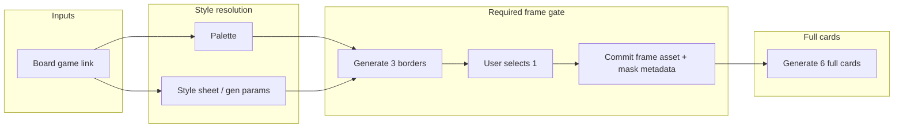
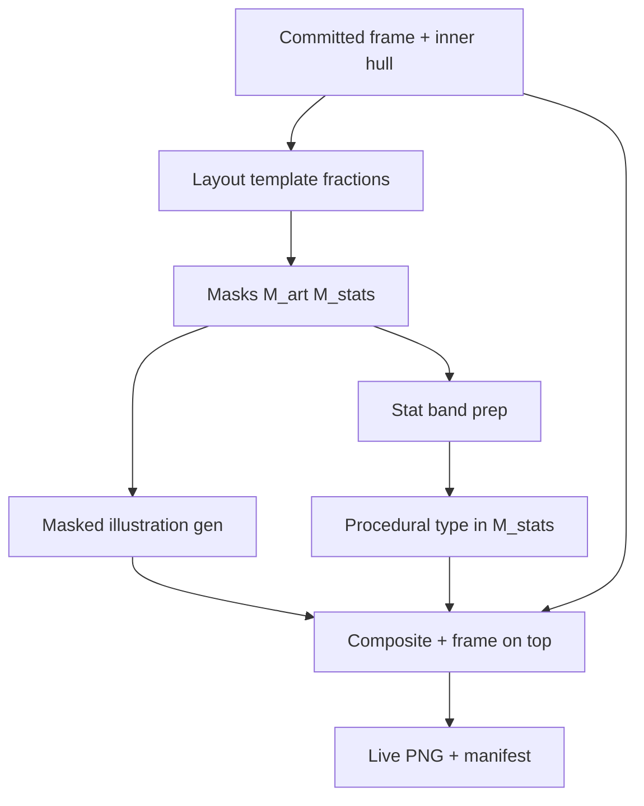

# Card Factory — technical specification

**Status:** Draft (planning)  
**Related product:** Board Factory (same repo / deployment family)  
**Last updated:** 2026-05-06

### Domain ownership

All **backend** work for Card Factory (FastAPI routes, services, repositories, DB entities for decks/sets, linking to `board_games`) goes under **`app/domains/cards/`** — import path ``domains.cards``. The **`pipeline/cardfactory/`** package stays image-only and must not grow HTTP handlers.

## 1. Summary

**Card Factory** is a parallel AI-driven pipeline for generating **playing-card-style game assets**, distinct from the board-layout pipeline but sharing infrastructure (providers, jobs, style discipline, and optionally **board-game linkage** for visual continuity).

A core product decision: **frame treatment is not optional or retrofitted.** Unlike Board Factory, where frame authoring evolved alongside perimeter cells and could feel bolted on, Card Factory treats **card border / frame definition as a mandatory early pipeline stage**. No “full card” generation runs until a **committed frame candidate** exists.

**Prompt authoring:** Per-card creative prompts (and optional stat-line strings) should be **derivable automatically** from the linked board — see **§6.7** — so users can progress without manually filling a “card brief editor” unless they choose to refine later.

## 2. Motivation

### 2.1 Why a separate pipeline

- Board Factory optimizes for **declarative grids**, mockup-driven analyze flows, and composited board previews. Cards are **uniform aspect targets**, heavy **border semantics**, and often **tighter brand consistency** across a small fixed set of layouts.
- Shipping Card Factory as its own surface area allows **different UX**, **different job graphs**, and **stricter invariants** (e.g. frame-before-content) without warping the board catalog schema.

### 2.2 Lessons from Board Factory frames

Board Factory’s frame work taught us that:

- Frames compete with **layout**, **vision**, and **batch reapply** concerns; when frames are optional, users can generate a lot of content before locking a frame, increasing rework.
- **Style + palette + frame** must agree before scaling asset counts.

Card Factory responds by making **frame selection a formal gate** in the initial pipeline.

## 3. Goals

| Goal | Notes |
| --- | --- |
| **G1 — Style continuity** | User picks an **existing Board Factory board game** to harvest **art style cues** and **color palette** (same spirit as style lock + catalog semantics). |
| **G2 — Required frame phase** | Pipeline always runs **border/frame generation → user selection → commit** before any **full card** generation. |
| **G3 — Fixed card geometry** | Target **5 : 7** aspect ratio for borders and full cards (playing-card–style portrait; consistent canvas; exact pixel dimensions — see §7–§8 and ``app/domains/cards/canvas.py``). |
| **G4 — Bounded exploration** | Generate **three** border variants; user picks **one**. Then generate **six** full cards using the **chosen frame**, **palette**, and **style**. |
| **G5 — Shared platform** | Reuse **app-level** infrastructure (FastAPI, jobs, DB, providers **as libraries**). **Pipeline code** under `pipeline/cardfactory/` is **isolated** — copy from `pipeline/boardfactory/` when useful rather than importing it (see §9). |
| **G6 — Agent-authored prompts** | After linking a board, an **AI agent** (LLM or orchestrated step) **fills per-card prompts** (illustration intent, flavor, stat copy as needed) from **board context** — catalog, style sheet, space/theme labels, mockup text — so the user is **not** required to type briefs before the first batch. |

## 4. Non-goals (initial phase)

- Replacing Board Factory or merging card generation into the board `Catalog` blob without a deliberate migration story.
- Full TCG rules engine, deck metadata, or print bleed — unless explicitly added later.
- Multi-user real-time collaboration on a deck.

## 5. User journey (MVP)

**Express intent:** The target flow is **choose board → (minimal gates) → generate a batch of cards**, without mandatory stops to **manually author prompts or card copy**. **§6.7** specifies **agent-generated prompts** from the selected board. Manual editing remains optional on regeneration.

**Interaction tension:** **G2** still requires a **frame/chrome selection** among candidates before full cards — that may be the **only** forced UI between board pick and batch unless product adds a **default frame** or automation later.

1. **Create Card Factory project** (working name: *deck*, *set*, or *card job* — see open questions).
2. **Link source board game** — user selects an existing **Board Factory** board they own or can read (authorization rules TBD).
3. **Resolve style inputs** — system loads:
   - **Style lock palette** (or equivalent extracted palette) from that board’s workspace/catalog path.
   - **Style / generation** parameters needed for prompts (model, quality, any locked style sheet text).
4. **Derive card payloads (automatic)** — **agent** produces structured content for each card slot (e.g. six): illustration prompts, procedural stat strings, titles — grounded in **§6.7** inputs. No user form required for the first run.
5. **Frame phase (required)**  
   - Generate **3** candidate **card borders** at **5 : 7** (border-only or “empty interior” — semantics §6).  
   - Present side-by-side (or stepped) **selection UI**.  
   - User **commits one** border as the **active frame** for this Card Factory project.
6. **Content phase**  
   - Pipeline generates **6 full cards** at **5 : 7** using **agent-derived prompts** from step **4**, **compositing** / **inpainting** within the committed frame, constrained by **palette** and **style**.  
7. **Review & export** — same general patterns as Board Factory (history, live, optional export bundle).

## 6. Artifacts and semantics

### 6.1 “Border” vs “full card”

Two layers (names are provisional):

- **Border candidate** — artwork that establishes **rim, corners, inner safe area**, and **mask** semantics for where card content may appear. May be generated as transparent interior + opaque frame, or as a single plate with a designated “hole”; implementation should pick one model and keep it consistent (Board Factory’s frame / mask story is the reference implementation to align with or wrap). See **§6.6** for committing **frame + bottom panel chrome** as one asset.

- **Full card** — **border + interior content** (illustration, typography region, icons) at the same **5 : 7** canvas, using the **committed border** as structure.

### 6.2 Aspect ratio

- **5 : 7** for **both** border exploration and full-card generation (portrait playing-card style).  
- Store **nominal pixel size** in config (defaults in ``app/domains/cards/canvas.py``, e.g. **720×1008**) so providers and previews stay consistent.

### 6.3 Interior art vs committed frame (prompts + pixels)

Once a **frame is committed**, card illustration passes should **not** ask the model to redraw the border:

- **Prompt contract (required):** Every interior-generation request must **inject explicit “no frame” instructions** before any card-specific creative text — e.g. *“Do not draw a card frame, decorative border, outer rim, or edge treatment; generate only the interior artwork that will sit inside an existing frame.”* (Exact wording is a product constant; intent: **do not generate a frame** — the committed border is applied in post.)  
- **Enforcement (required):** Treat prompts as **hints**. **Geometry wins:** generate or inpaint **only inside a mask** (the “hole” and any subdivisions). Anything outside the mask is either transparent, filled with a solid keyed color for removal, or overwritten in post by the border PNG / alpha composite. That matches how Board Factory stays honest about frames — Card Factory should adopt the same discipline from day one.

### 6.4 Guaranteed layout regions (e.g. bottom third for “Attack +1”)

Image models do **not** reliably honor fractional layout (“bottom third”) from text alone. To **guarantee** regions:

1. **Define a layout spec** in data (e.g. fractions of the **interior** rect: main art **top 2/3**, **stats / text band bottom 1/3**), stored relative to the committed frame’s inner polygon or bbox.
2. **Split masks** — separate polygons or rects for **illustration** vs **stat strip** (or one illustration mask if stats are procedural).
3. **Generation** — run **illustration** in the upper mask only; leave the stat band empty, flat, or a simple wash **or** generate a tiny texture there if desired.
4. **Stats / numbers** — strongest guarantee is **procedural**: render “Attack +1” with palette-bound typography (PIL / bitmap font) into the bottom band **after** generation, or use a small template. Fully AI-generated tiny text in pixel art is often illegible.

So: **shape is guaranteed by masks + compositing (+ optional vector/bitmap text)**, not by prompt wording alone. The executable breakdown is **§8**.

### 6.5 Resolution: match the board game or not?

The linked board game supplies **style** and **palette** (and maybe prompt vocabulary). It does **not** need to dictate **card pixel dimensions**:

- Board spaces are often **square or irregular** tiles; cards are **5 : 7**. There is no natural “same resolution” unless you arbitrarily scale.
- **Recommendation:** Card Factory uses a **single canonical resolution** per project (or global config), e.g. **720×1008** or **1080×1512**, independent of board cell sizes. **Downstream export** can scale if print specs demand it.
- **Optional:** If you want visual parity with **perceived** sharpness on the board, you could scale canonical card resolution so **pixels-per-unit-height** feels similar to a reference cell — that is a **product tuning** knob, not a strict technical requirement. Default remains: **fixed card resolution**, **style-only** inheritance from the board.

### 6.6 Alternative strategy: unified chrome (frame + text panel)

Instead of treating the **bottom stats band** as a visually separate strip composited next to a **ring-only** frame, the product may commit **one “chrome” asset** that includes **both**:

- the **outer frame / border**, and  
- **decorative treatment around the text panel** (plaque, banner, carved strip — the **surround** for stats, not the numeric glyphs).

**Why:** Selecting **frame + text-panel chrome** as a unit keeps **ornament coherent**; the pipeline then focuses AI on **filling only the illustration window**, with **procedural type** rendered into a **reserved stats sub-rect** already bounded by that chrome.

**How it still fits this spec:**

- **Layout JSON** (§10.1) continues to define **normalized regions** — at minimum **`illustration`** and **`procedural_stats`** — relative to the **inner hull**. Masks **M_art** and **M_stats** are unchanged in principle.
- **SVG** (`tech-spec/card-factory/layout-schematic.svg`) remains useful as a **human legend**; it can also serve as an **authoring source** for mask paths when rasterizing to pipeline resolution.
- **Committed PNG** may paint **opaque chrome everywhere except** transparent holes for **art** and optionally a **flat interior** for the stats glyphs (or stats hole left clear for full procedural overlay).

#### Chrome-phase paint mask (required when chrome is AI-generated)

Ring-only frame flows already rely on **holes** + compositing. **Unified chrome** must do the same **during the chrome / frame-gate generation**, not only during full-card assembly:

1. **Forbidden zones** — pixels that **must never** receive AI paint from the chrome pass (remain fully transparent so later steps stay clean):  
   - **Illustration aperture** — region mapped to layout role **`illustration`** (future main art).  
   - **Stats glyph plate** — interior of **`procedural_stats`** reserved for procedural typography (typically the **`procedural_stats` rect inset by `typography.padding`** from the layout template — define **`M_stats_text`** as that inset rect).

2. **Allowed paint mask** — **`M_chrome_paint`** = full canvas minus forbidden zones (equivalently: union of frame rim + stats **surround** / plaque ornament **excluding** `M_stats_text`, plus any corridors between — exact geometry is data-driven from inner hull + layout JSON).

3. **Provider call** — Chrome candidate generation **must** restrict deposits to **`M_chrome_paint`** (masked generation / inpaint with correct semantics for your provider). Prompt-only guidance is **not** sufficient.

4. **Post-decode hardening** — After each chrome decode, **clamp**: force **full transparency** inside **illustration ∪ `M_stats_text`** so model bleed cannot contaminate the art window or glyph box.

Executable checklist for the frame gate: **§8.2**.

Per-card illustration generation (§8 step **5**) continues to use **`M_art`** as today; the chrome phase is **separate** and runs **before commit**. Ring-only frames without a distinct glyph hole still omit **`M_stats_text`** from forbidden zones **only if** stats are purely procedural over an opaque band — product choice documented per layout template.

**Caveats (unchanged in intent):**

- **Final numbers / labels** remain **procedural** (§6.4); unified chrome supplies **surround**, not trustworthy micro-type.
- **§8 layer order** still applies; mentally rename “frame overlay” to **chrome overlay** if that layer includes the bottom panel decoration — illustration and stats ink sit **under** or **between** sub-layers as designed.

Product may ship **either** ring-only frames **or** unified chrome **or** user-selectable modes; pipeline invariants (**masks + commit before full cards**) stay the same.

### 6.7 Automated prompt derivation (agent)

Card Factory should **not** depend on users typing six separate briefs before the first generation.

- **Trigger:** After **board link** + style resolution, an **agent step** (same class of tool as Board Factory **analyze** — LLM over structured context) produces **per-slot payloads**: illustration prompts (for §8 masked generation), optional **stat-line strings** for procedural type, optional titles — **grounded in the linked board**.
- **Inputs to the agent (minimum):** board **catalog** excerpts (space kinds, labels, flavor text), **style sheet / generation** block, **palette** summary, optional **mockup** caption or theme sentence if present.
- **Outputs:** Stored **structured records** per card index (schema aligns with future `card_instances`); downstream pipeline concatenates §6.3 **no-frame** prefix + agent illustration body when calling providers.
- **UX:** Default path uses these outputs **without** showing a mandatory **card brief editor**; users may **edit** prompts only when refining a slot (regeneration).

This satisfies **G6** and the **express intent** in §5; it does **not** remove the **frame-selection** gate (**G2**) unless product adds automation there separately.

## 7. Pipeline graph (conceptual)

**Invariant:** `C` does not start until `Commit` succeeds.

For **how** “generate 6 full cards” decomposes into mask-bound steps after commit, see **§8**.

## 8. Pipeline steps: geometry-safe full card assembly

This section turns §6.3–§6.4 into an **ordered pipeline**. Steps run **per card** (possibly batched as one job). All steps assume a **committed frame** (border PNG + inner geometry metadata) and canonical canvas size.

| Step | Name | Purpose | Requirements |
| --- | --- | --- | --- |
| **1** | **Canonicalize canvas** | Map the committed frame to fixed **W×H** (project resolution). | Single source dimension tuple per deck; frame asset scaled or validated to match; fail fast if aspect diverges from **5 : 7** beyond tolerance. |
| **2** | **Resolve inner hull** | Compute **interior** bounds — bbox and/or inner polygon — where AI art is allowed. | Derived from committed frame metadata (not from prompts); persisted (`inner_rect` / polygon vertices); stable across regenerations of the same card slot. |
| **3** | **Apply layout template** | Turn **layout spec** (fractions of the interior, e.g. **2/3 art / 1/3 stats**) into pixel regions. | Layout is **data** validated against **JSON Schema** — see **§10.1** (`tech-spec/card-factory/layout-template.schema.json`); fractions reference the **inner** coordinate system; regions clipped to inner hull; runtime validation should assert disjoint illustration vs stats bands when required. |
| **4** | **Rasterize masks** | Build **M_art** and **M_stats** (binary or alpha masks full canvas). | Same dimensions as canvas; **disjoint** art vs stats regions (unless product explicitly allows overlap); written to workspace + **hashes in manifest** for reproducibility. |
| **5** | **Generate illustration (masked)** | Call provider **only** inside **M_art** (inpaint / masked img2img / masked txt2img — whichever the isolated `cardfactory` impl supports). | Prepend §6.3 **no-frame** prompt block; discard or zero pixels outside **M_art** before composite; optional palette quantize on this layer only. |
| **6** | **Stat band pixel prep** | Prepare the stats region without relying on legible AI text: flat fill, subtle gradient, noise, or optional **second masked gen** for texture only. | **No requirement** that the model paints readable numbers; final strings come from step **7**. |
| **7** | **Procedural typography** | Draw brief-driven strings (e.g. “Attack +1”) into **M_stats** using palette-bound fonts (PIL / bitmap font). | Font sizes clamped for readability; optional stroke/outline for contrast; text bbox stays inside stats rect with padding; supports localization later without rerunning AI. |
| **8** | **Layer composite** | Merge layers **bottom → top** (e.g. plate → illustration → stat background → text → **frame overlay** last). | Alpha-aware ordering; **frame wins** at edges; no duplicate frame drawn by AI visible because illustration was masked and frame is top layer. |
| **9** | **Final cleanup & publish** | Global palette enforcement if needed, export **live** PNG + manifest. | Manifest records: `frame_commit_id`, `layout_template_id`, mask hashes, provider ids; history/live parity with Board Factory patterns. |

### 8.1 Optional variant: single interior pass first

If product wants fewer provider calls: steps **5–6** can collapse to **one** generation inside **M_art ∪ M_stats** with prompts forbidding busy stats text, then **clear M_stats** to flat color before step **7**. Requirements still hold: stats readability comes from step **7**, not the model.

### 8.2 Chrome candidate generation (unified chrome mode)

When producing **AI-authored unified chrome** at the frame gate (§7), **before** user selection / commit:

| Requirement | Detail |
| --- | --- |
| Derive **`M_stats_text`** | From layout template: **`procedural_stats` rect** minus **`typography.padding`** (inset glyph box). Persist coordinates with chrome candidates. |
| Build **`M_chrome_paint`** | Canvas minus **illustration** aperture ∪ **`M_stats_text`** (see §6.6). |
| Provider call | Restrict paint to **`M_chrome_paint`**; §6.3-style prompts optional but **not** sufficient alone. |
| Post-decode | Zero alpha inside illustration aperture ∪ **`M_stats_text`**; validate no stray opaque pixels in forbidden zones before showing picker / committing. |

Ring-only frame candidates omit **`M_stats_text`** from forbidden zones **unless** the layout reserves an explicit glyph plate — template-dependent.

### 8.3 Diagram (per-card assemble)

## 9. Repository layout and isolation

### 9.1 Pipeline package (`pipeline/cardfactory/`)

- Card Factory’s **pipeline lives only under** `pipeline/cardfactory/` (name TBD but **must not** import from `pipeline/boardfactory`).
- **Copy-paste is acceptable** for modules that would otherwise create a hard dependency (ops, steps, provider helpers). Drift between the two pipelines is an explicit trade for **independence**; keep sensitive shared logic at the **application** layer (e.g. one canonical “resize + paste under alpha”) only if both teams agree — otherwise duplicate.

### 9.2 What may still be shared (non-pipeline)

| Layer | Sharing policy |
| --- | --- |
| **FastAPI app, jobs, SSE, cost ledger** | Shared — **`domains.cards`** routes invoke the same job runner. |
| **Provider implementations** | Shared **as libraries** — e.g. instantiate the same OpenAI / PixelLab clients from `pipeline/boardfactory/providers/` **only if** imported as a **thin adapter** from `app/` or a neutral `pipeline/common/` package. If even that couples releases, **vendor a minimal client copy** inside `pipeline/cardfactory/providers/`. Prefer **no** `from boardfactory import …` **inside** `pipeline/cardfactory`. |
| **DB / paths / workspace conventions** | Shared patterns; Card Factory uses **its own** workspace roots and manifests. |
| **Palette file reads from linked board** | App layer: read Board Factory outputs / catalog and pass **resolved palette + style dict** into Card Factory jobs as **plain data**. |

### 9.3 Mental model

**Board Factory pipeline ≠ Card Factory pipeline.** The app wires both; they do not import each other.

## 10. New surface area (expected)

- **`domains/cards/`** — **all** Card Factory backend: `models`, `repository`, `services`, `routes_html`, `routes_api` per `app/ARCHITECTURE.md`. Do not put Card Factory HTTP under `domains/boards/` or ad-hoc top-level packages.
- **`pipeline/cardfactory/`** — image pipeline only (`ops/`, `steps/`); **no** imports from `pipeline/boardfactory`.
- **DB entities** (follow-up ER pass): link to `board_games.id`, frame commit pointer, `layout_template_id`, card slots / `card_instances` rows.

Exact relational schema is TBD; behavioral requirements are in this doc and in the layout template schema.

### 10.1 Layout template (JSON)

Shipped artifacts:

| File | Purpose |
| --- | --- |
| `tech-spec/card-factory/layout-template.schema.json` | **JSON Schema** for layout templates (`schema_version`, `id`, `coordinate_space`, `regions[]` with `role` + normalized `rect`). |
| `tech-spec/card-factory/examples/layout-portrait-2_3-1_3.json` | **Default MVP template** — upper **2/3** `illustration`, lower **1/3** `procedural_stats`, typography hints for the stats band. |
| `tech-spec/card-factory/layout-schematic.svg` | **Human-readable skeleton** — wireframe at **5∶7** showing **frame band**, **inner hull**, **art** vs **stats** zones (not pixel-accurate to a real frame; real geometry comes from committed frame metadata + JSON fractions). Use in docs or UI as a legend. |

The **JSON** drives masks in code; the **SVG** is an explanatory diagram only.

**Runtime validation:** JSON Schema covers shape; the pipeline must still verify region roles (e.g. exactly one `illustration` + one `procedural_stats` for the MVP template), disjoint rects, and **sum(height)** ≈ **1** along the layout axis where bands stack.

**Manifest:** Persist `layout_template_id` (the template's `id` field) on each generated card asset row so regenerations stay deterministic.

## 11. API / UX sketch (non-binding)

- **HTML:** Default path — board picker → **optional style summary** (can be inline) → **frame/chrome picker** (required per **G2**) → **batch progress** — **no mandatory card-brief form**; prompts come from **§6.7**. Optional **refine** screens when editing a single card.
- **Global navigation (spec only — not implemented yet):** Users reach Card Factory from the **top link bar** on the site shell. The nav slot that currently acts as the **“Preview”** link (the Preview entry in that bar) should be **replaced** by the Card Factory affordance — same position in the bar, label/destination updated so Card Factory is the primary entry from that slot rather than duplicating the bar with an extra link. Exact route and copy TBD when shipping.  
- **JSON:** REST + SSE consistent with Board Factory job polling.  
- **Authorization:** same user model; “can read style from linked board” must be enforced server-side.

## 12. Risks and mitigations

| Risk | Mitigation |
| --- | --- |
| Board without style lock / incomplete palette | Block or warn before border generation; offer “analyze style from mockup” only if we explicitly support it for Card Factory. |
| Frame–content misalignment at 5 : 7 | Single canonical resolution; deterministic mask from committed border; integration tests on composite bounds. |
| Cost surprises (3 borders + 6 cards) | Show estimates per phase; align with existing cost ledger patterns. |
| Code duplication between pipelines | Accept duplication for isolation; extract **only** battle-tested primitives to a neutral module if duplication becomes painful. |
| Double frames or border creep in interiors | Prompt “interior only” **plus** strict inpaint/mask; composite frame on top (§6.3). |
| Illegible AI stat text | Procedural type in **`M_stats`** (§6.4); **never** rely on chrome pass for glyphs. Reserve **`M_stats_text`** during chrome gen (**§6.6**, **§8.2**). |
| Busy noise / texture inside stats glyph box after chrome gen | **`M_chrome_paint`** restriction + post-decode transparency clamp on illustration ∪ **`M_stats_text`** (**§6.6**, **§8.2**). |

## 13. Open questions

1. **Product entity name** — *Deck*, *Card set*, *Print run*?  
2. **Pixel dimensions** for 5 : 7 (e.g. 720×1008 vs 1080×1512) — **canonical Card Factory resolution**, not tied to board cell size (see §6.5).  
3. **Six cards** — fixed MVP count vs configurable `N`?  
4. **Card brief schema** — agent outputs (**§6.7**) populate defaults; manual override on regenerate only vs full editor TBD.  
5. **Layout template** — default **`portrait-two-band-v1`** is shipped (§10.1); per-deck override vs global registry TBD.  
6. **Linking model** — must the source board be **owned** by the user, or is **read-only share** enough for palette/style?  
7. **Typography** — generated as pixels vs overlaid web fonts in export?  
8. **Single repo vs package split** — MVP almost certainly same repo; document boundary (`pipeline/cardfactory`) to allow future extraction.  
9. **Frame gate vs express UX** — can the **frame/chrome** step be skipped or auto-defaulted so the only clicks after board select are **Generate**, or is picker interaction required for **G2**?  

## 14. Success criteria (MVP)

- User cannot trigger **full card** generation without a **committed** border/frame.  
- All generated assets for the MVP flow are **5 : 7** and visually consistent with the **linked board’s palette and style**.  
- **Three** borders generated; **one** selected; **six** full cards delivered with clear history and cost attribution.

---

*This document is the starting point for implementation tickets and schema design; revise sections 10–13 as decisions land.*
